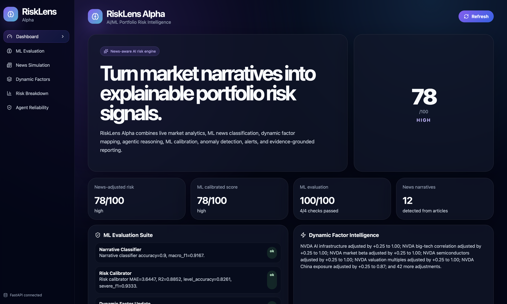
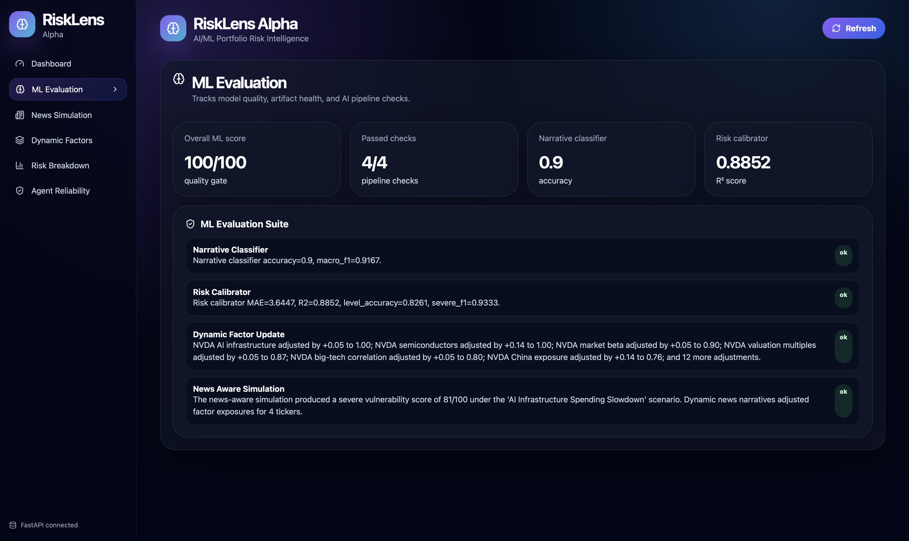
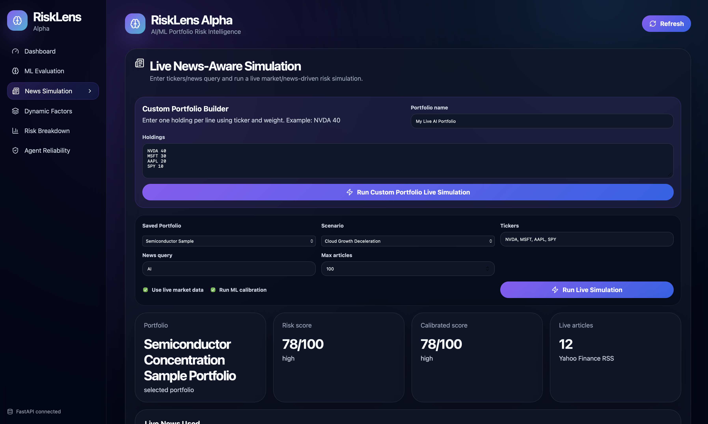

# RiskLens Alpha

RiskLens Alpha is a full-stack AI/ML portfolio risk intelligence platform that converts live market data, live financial news, scenario shocks, and portfolio exposures into explainable risk scores, calibrated ML outputs, evidence summaries, reports, alerts, and dashboard visualizations.

The system allows a user to enter a custom portfolio, select a macro/sector scenario, provide tickers and a live news query, then run a live news-aware simulation that updates factor exposures and portfolio vulnerability in real time.

---

## Key Capabilities

- Custom portfolio simulation using user-entered holdings
- Live financial news ingestion using Yahoo Finance RSS
- Live market data and portfolio metrics using yfinance
- Dynamic portfolio weight recalculation
- Scenario-based portfolio vulnerability scoring
- ML financial-news narrative classification
- News narrative extraction and dynamic factor updates
- ML risk calibration model
- Agentic risk debate with multiple reasoning agents
- Agent disagreement and uncertainty scoring
- Hidden concentration detection
- Confidence interval estimation
- Historical shock replay
- ETF benchmark comparison
- Timeline anomaly detection
- Alerts and background refresh jobs
- Evidence tracking for explainability
- HTML and PDF report generation
- React dashboard with live simulation controls
- Docker full-stack setup
- Final validation script covering backend, ML, reports, live news, and frontend build

---

## Demo Screenshots

> Add screenshots under `docs/images/`.

### Dashboard



### ML Evaluation / API



### News-Aware Simulation



---

## Architecture

```text
User Portfolio + Scenario + News Query
                |
                v
        React Frontend Dashboard
                |
                v
            FastAPI Backend
                |
    ------------------------------------------------
    |              |              |                |
Market Data   Live News      Scenario Engine   Database
 yfinance    Yahoo RSS       Factor Mapping    SQLite
    |              |              |                |
    ------------------------------------------------
                |
                v
       ML Narrative Classifier
                |
                v
      News Narrative Extraction
                |
                v
      Dynamic Factor Updating
                |
                v
      Risk Scoring + Agent Debate
                |
                v
   Hidden Concentration + Confidence
                |
                v
       ML Risk Calibration Model
                |
                v
 Reports + Alerts + Dashboard + Evaluation
```

---

## Tech Stack

### Backend

- Python
- FastAPI
- Pydantic
- SQLite
- SQLAlchemy
- pandas
- NumPy
- scikit-learn
- yfinance
- Jinja2
- Chromium-based PDF export
- pytest

### Frontend

- React
- TypeScript
- Vite
- Axios
- Lucide React
- Custom dark dashboard UI

### DevOps

- Docker
- Docker Compose
- Local volumes for reports, outputs, cache, and database

---

## AI/ML Components

### 1. Financial News Narrative Classifier

A supervised ML classifier maps financial news headlines and summaries into market-risk narratives such as:

- AI infrastructure slowdown
- Cloud growth deceleration
- Semiconductor export restriction
- Higher-for-longer interest rates
- Consumer demand weakness
- Banking stress
- Oil/inflation shock

Model metrics:

```text
Accuracy: 0.90
Macro F1: 0.9167
```

### 2. Dynamic Factor Update Engine

Live/extracted narratives modify ticker-factor exposures. Example:

```text
NVDA AI infrastructure: 0.97 -> 1.00
NVDA semiconductors: 0.96 -> 1.00
NVDA China exposure: 0.62 -> 0.82
MSFT cloud growth: 0.92 -> 1.00
```

### 3. ML Risk Calibration Model

A Random Forest-based calibration layer estimates:

- calibrated risk score
- calibrated risk level
- severe-risk probability

Model metrics:

```text
Score MAE: 3.6447
Score R2: 0.8852
Risk-level accuracy: 0.8261
Severe-risk F1: 0.9333
```

### 4. Agentic Risk Debate

The system generates structured opinions from multiple risk-analysis agents:

- Sector Agent
- Company Agent
- Technical Risk Agent
- Contrarian Agent
- Aggregator/Judge

It also computes agent disagreement to measure reliability and uncertainty.

### 5. Timeline Anomaly Detection

Saved risk timeline data is monitored for unusual jumps in:

- vulnerability score
- hidden concentration
- confidence interval width

---

## Example Live Simulation Flow

A user enters:

```text
Portfolio:
NVDA 40
MSFT 30
AAPL 20
SPY 10

Scenario:
AI Infrastructure Spending Slowdown

News query:
AI

Tickers:
NVDA, MSFT, AAPL, SPY
```

RiskLens Alpha then:

```text
1. Fetches live Yahoo Finance news
2. Pulls market data with yfinance
3. Extracts risk narratives
4. Updates factor exposures
5. Runs scenario scoring
6. Runs ML calibration
7. Displays explainable results in the dashboard
```

---

## Current Validation Results

Final project check:

```text
Backend tests: 136 passed
ML evaluation: 100/100
Risk calibrator evaluation: passed
Live news simulation: passed
Timeline anomaly detection: passed
HTML report generation: passed
PDF report generation: passed
Frontend production build: passed

Final validation: 8/8 passed
```

Run the full validation:

```bash
PYTHONPATH=. python scripts/final_project_check.py
```

---

## Local Setup

### 1. Clone the repository

```bash
git clone https://github.com/AneeshHatkar/risklens-alpha.git
cd risklens-alpha
```

### 2. Create virtual environment

```bash
python -m venv .venv
source .venv/bin/activate
```

### 3. Install backend dependencies

```bash
pip install -r backend/requirements.txt
```

### 4. Initialize database

```bash
PYTHONPATH=. python scripts/init_db.py
```

### 5. Run backend

```bash
PYTHONPATH=. uvicorn backend.app.api:app --reload --port 8000
```

Backend docs:

```text
http://127.0.0.1:8000/docs
```

### 6. Run frontend

In another terminal:

```bash
cd frontend
npm install
npm run dev
```

Frontend:

```text
http://localhost:5173
```

---

## Docker Setup

Run the full stack:

```bash
docker compose up --build
```

Backend:

```text
http://localhost:8000
```

Frontend:

```text
http://localhost:5173
```

API docs:

```text
http://localhost:8000/docs
```

Stop:

```bash
docker compose down
```

Reset volumes:

```bash
docker compose down -v
```

---

## Useful Commands

### Backend tests

```bash
PYTHONPATH=. pytest backend/app/tests -q
```

### Frontend build

```bash
cd frontend
npm run build
```

### ML evaluation

```bash
PYTHONPATH=. python scripts/run_ml_evaluation.py
```

### Live news simulation

```bash
PYTHONPATH=. python scripts/check_live_news_simulation.py
```

### Generate HTML report

```bash
PYTHONPATH=. python scripts/generate_report.py
```

### Generate PDF report

```bash
PYTHONPATH=. python scripts/generate_pdf_report.py
```

### Final validation

```bash
PYTHONPATH=. python scripts/final_project_check.py
```

---

## Main API Endpoints

### ML Evaluation

```http
GET /ml/evaluate
```

### Standard Simulation

```http
POST /simulate
```

### News-Aware Simulation

```http
POST /simulate-with-news
```

### Live News Fetch

```http
POST /news/live
```

### Live News Simulation

```http
POST /simulate-with-live-news
```

### Custom Portfolio Live Simulation

```http
POST /simulate-custom-live-news
```

Example request:

```json
{
  "portfolio_name": "My Custom AI Portfolio",
  "holdings": [
    {"ticker": "NVDA", "weight": 40},
    {"ticker": "MSFT", "weight": 30},
    {"ticker": "AAPL", "weight": 20},
    {"ticker": "SPY", "weight": 10}
  ],
  "scenario_id": "ai_capex_slowdown",
  "news_tickers": ["NVDA", "MSFT", "AAPL", "SPY"],
  "query": "AI",
  "max_articles": 5,
  "use_market_data": true,
  "run_ml_calibration": true
}
```

---

## Project Structure

```text
risklens-alpha/
├── backend/
│   └── app/
│       ├── ml/
│       ├── services/
│       ├── tests/
│       ├── api.py
│       ├── database.py
│       ├── models.py
│       └── schemas.py
├── frontend/
│   ├── src/
│   ├── Dockerfile
│   └── package.json
├── datasets/
├── reports/
├── outputs/
├── scripts/
├── docs/
├── Dockerfile.backend
├── docker-compose.yml
└── README.md
```

---

## Limitations

- This project is educational and not financial advice.
- Yahoo Finance RSS is used for live news ingestion; production systems should use licensed news feeds.
- yfinance is used for market data; production trading systems should use institutional-grade feeds.
- ML models are trained on small project datasets and simulated labels for demonstration.
- Risk scores are scenario-analysis estimates, not predictions of guaranteed future returns.

---

## Future Improvements

- Add NewsAPI/Finnhub/Polygon.io live news providers
- Add FinBERT or transformer-based financial sentiment model
- Add embedding-based evidence retrieval
- Add GitHub Actions CI/CD
- Add deployment to Render/Railway/Vercel
- Add authentication and multi-user support
- Add Postgres option for production storage
- Add portfolio optimization and stress-testing reports

---

## Resume Bullets

- Built a full-stack AI/ML portfolio risk intelligence platform using FastAPI, React, SQLite, Docker, scikit-learn, and yfinance to simulate portfolio vulnerability under macro and sector shocks.
- Developed ML-driven financial news narrative classification and dynamic factor mapping that converts live Yahoo Finance RSS news into ticker-level risk exposure adjustments.
- Implemented a Random Forest risk calibration model achieving 0.885 R², 3.64 MAE, 82.6% risk-level accuracy, and 0.933 severe-risk F1 on generated risk calibration data.
- Designed explainability features including agentic risk debate, hidden concentration scoring, confidence intervals, evidence tracking, and timeline anomaly detection.
- Delivered a React dashboard and Dockerized full-stack workflow with 136 backend tests, 100/100 ML evaluation score, live news simulation, HTML/PDF reporting, and end-to-end validation.
